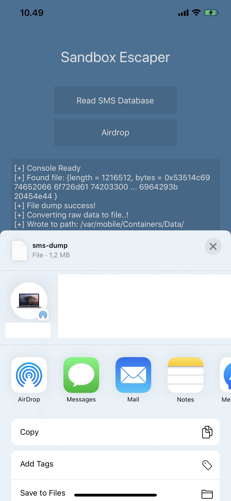

<h4>Description</h4>

This is a POC of a Sandbox escape found by [@s1guza](https://twitter.com/s1guza).

In this demo, we're using the `com.apple.private.security.storage.Messages` entitlement to access the SMS database - you can customise your entitlements in Projects->Targets->SandboxEscape->Build Phases->Run Script. (Thanks for that: [@CodeColorist](https://twitter.com/CodeColorist)).

Follow me on Twitter: [@declanland](https://twitter.com/declanland)

  
